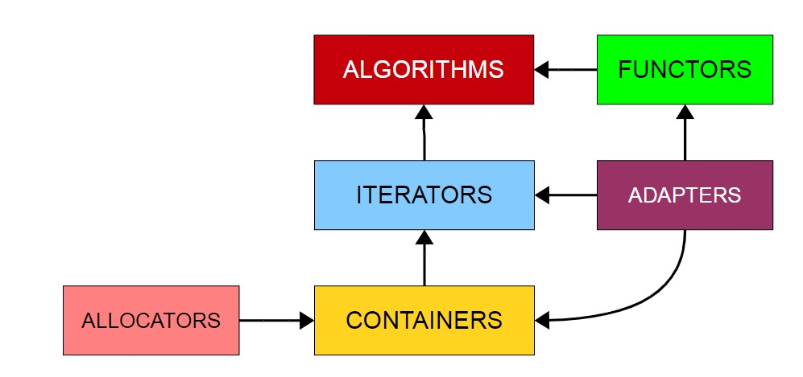
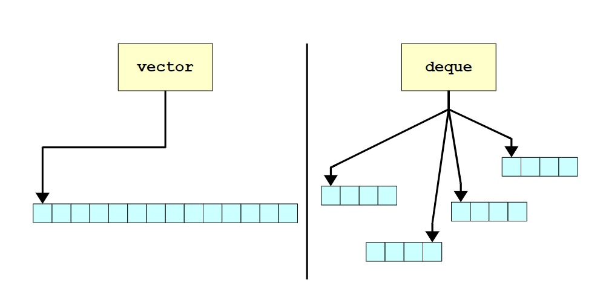

<!--
 * @Author: aweary 2875226921@qq.com
 * @Date: 2022-09-04 21:27:15
 * @LastEditors: aweary 2875226921@qq.com
 * @LastEditTime: 2022-09-04 22:09:38
 * @FilePath: \mdnote\Chapter 5 STL Sequence Containers.md
 * @Description: 
 * 
 * Copyright (c) 2022 by aweary 2875226921@qq.com, All Rights Reserved. 
-->
# STL Sequence Containers

## overview of STL

- ***Containers***.
  >  At the heart of the STL are a collection of container classes, standard C++'s analog to the CS106B/X ADTs.  For example, you can store an associative collection of key/value pairs in an STL map, or a growing list of elements in an STL vector.
- ***Iterators***.
  >  Each STL container exports iterators, objects that view and modify ranges of stored data.  Iterators have a common interface, allowing you to write code that operates on data stored in arbitrary containers.
- ***Algorithms***.
  >  STL algorithms are functions that operate over ranges of data specified by iterators. The scope of the STL algorithms is staggering – there are algorithms for searching, sorting, reordering, permuting, creating, and destroying sets of data.
- ***Adapters***.
  > STL adapters are objects which transform an object from one form into another.  For example, the  stack  adapter transforms a regular  vector  or  list  into a LIFO container, while the istream_iterator transforms a standard C++ stream into an STL iterator.
- ***Functors***.
  >  Because so much of the STL relies on user-defined callback functions, the STL provides facilities for creating and modifying functions at runtime.  We will defer our discussion of functors to much later in this text, as they require a fairly nuanced understanding of C++.
- ***Allocators***.
  >  The STL allows clients of the container classes to customize how memory is allocated and deallocated, either for diagnostic or performance reasons.  While allocators are fascinating and certainly worthy of discussion, they are beyond the scope of this text and we will not cover them here.



## vector

语法：

``` cpp
//头文件
#include<vector>

vector<int> myVector;//创建空向量
vector<int> myVector(15);//创建大小为15的vector，默认为0
vector<double> myReal(20,137.0);//创建20大小，初始值为137.0的向量


```

<>内的叫template argument。vector后面必须都有

添加元素的方法

- myVector.push_back(val)
  - 新添加的元素在最后

- ***size_t*** 类型只能存非负值
  - 用于容器索引时

- myVector.size() 
  - 返回元素个数

``` cpp
void SelectionSort(vector<int>& v) {
        for (size_t i = 0; i < v.size(); ++i) {
            size_t smallestIndex = GetSmallestIndex(v, i); // We'll write this
                                                           // function momentarily
            swap (v[i], v[smallestIndex]);
        }
    }
```

- vector插入元素
  - v.insert(v.begin() + position, element);
  - position从0到v.size()

- .resize()
  - 从向量末尾开始算起，第二个参数为改变size时新添加的元素，默认为0

``` cpp
vector<int> myVector; // Defaults to empty vector
    PrintVector(myVector); // Output: [nothing]
    myVector.resize(10); // Grow the vector, setting new elements to 0
    PrintVector(myVector); // Output: 0 0 0 0 0 0 0 0 0 0
    myVector.resize(5); // Shrink the vector
    PrintVector(myVector); // Output: 0 0 0 0 0
    myVector.resize(7, 1); // Grow the vector, setting new elements to 1
    PrintVector(myVector); // Output: 0 0 0 0 0 1 1
    myVector.resize(1, 7); // The second parameter is effectively ignored.
    PrintVector(myVector); // Output: 0
```

- .pop_back()
- .erase()
  - 删除某个元素
  - syntax:myVector.erase(myVector.begin() + n);//n是索引
- .clear()
  - 清空向量

## deque

大多数method和vector一样

- .push_front()
- .pop_front()

- 存储方式


vector 在头部加一个元素，整体都要移动，而deque在头部加一个元素只需要移动一个single page

在头部和尾部插入和删除元素时，用deque

